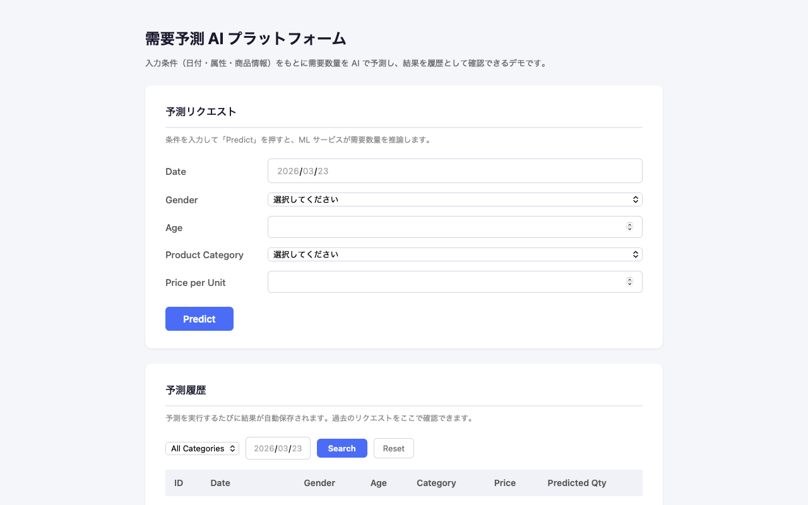
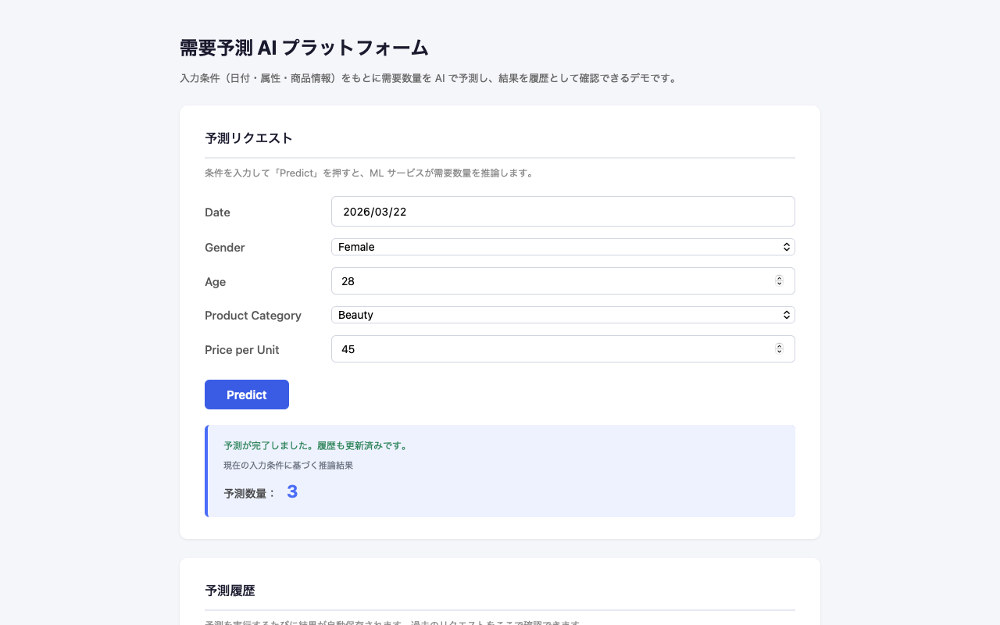
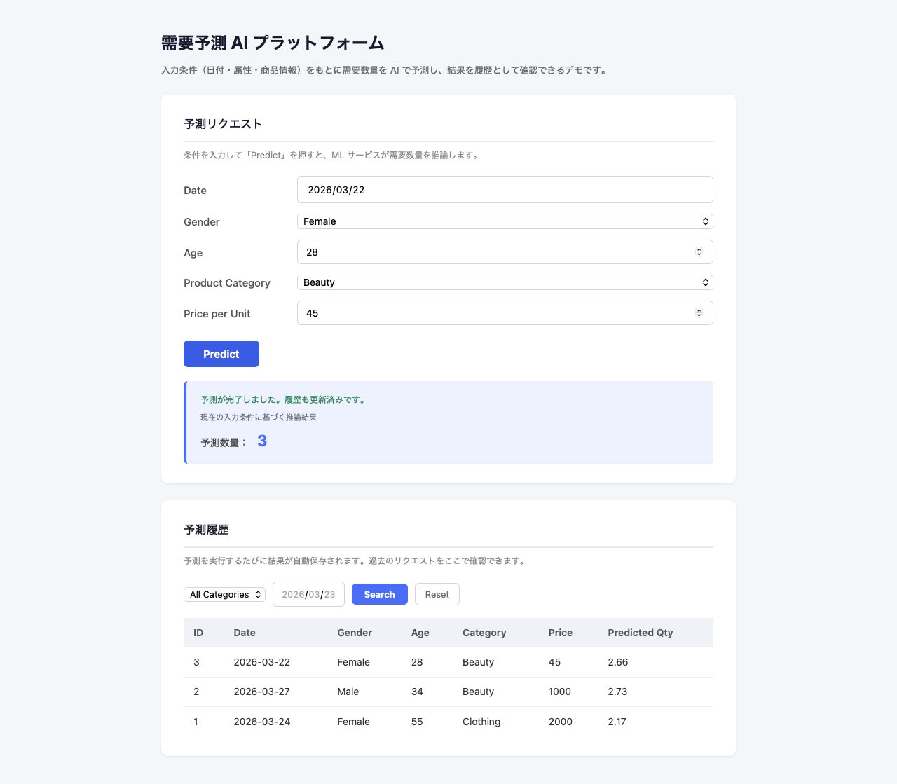
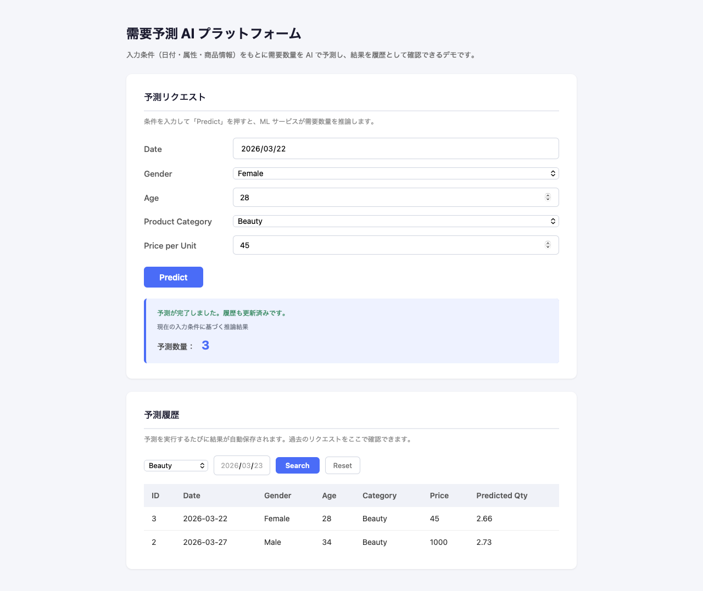

# 需要予測 AI プラットフォーム

日付・性別・年齢・商品カテゴリ・単価を入力すると、ML モデルが需要数量を推論して返すフルスタック AI システムです。
Java バックエンド・Python ML サービス・React フロントエンドを REST で繋いだマイクロサービス構成で実装しています。

> **English version:** [README_EN.md](./README_EN.md)

---

## 目次

1. [プロジェクト概要](#1-プロジェクト概要)
2. [システム構成](#2-システム構成)
3. [技術スタック](#3-技術スタック)
4. [主な機能](#4-主な機能)
5. [API 仕様](#5-api-仕様)
6. [データフロー](#6-データフロー)
7. [設計上のポイント](#7-設計上のポイント)
8. [V2: S3 成果物管理](#8-v2-s3-成果物管理)
9. [今後の拡張（V3+）](#9-今後の拡張v3)
10. [AWS デプロイ方針](#10-aws-デプロイ方針)
11. [起動方法](#11-起動方法)
12. [動作確認](#12-動作確認)
13. [トラブルシューティング](#13-トラブルシューティング)
14. [スクリーンショット](#14-スクリーンショット)

---

## 1. プロジェクト概要

小売・EC 領域における需要予測をテーマにした AI プラットフォームです。
顧客の属性情報と商品情報を入力すると、学習済み機械学習モデルが需要数量を推論し、結果を UI に表示するとともに PostgreSQL に履歴として保存します。

このプロジェクトは以下の能力を一貫したシステムとして示すために構築しました：

- **Java バックエンド**: Spring Boot による REST API 設計・JPA 永続化
- **Python ML サービス**: FastAPI + scikit-learn による推論サービス
- **API 設計**: 入力バリデーション・エラーハンドリング・レスポンス統一
- **フロントエンド**: React による状態管理・非同期通信・フォーム制御
- **Docker**: マルチサービス構成のコンテナ化

---

## 2. システム構成

```
ブラウザ
  │
  ▼
┌──────────────────────┐
│  Frontend            │  React (Vite)
│  localhost:3000      │  フォーム入力 / 結果表示 / 履歴一覧
└──────────┬───────────┘
           │ REST / JSON
           ▼
┌──────────────────────┐
│  API Gateway         │  Spring Boot (Java)
│  localhost:8080      │  入力受付 / ML 呼び出し / DB 永続化
└──────┬───────┬───────┘
       │       │
       │ REST  │ JPA
       ▼       ▼
┌──────────┐  ┌──────────────┐
│ML Service│  │  PostgreSQL  │
│:8000     │  │  :5432       │
│FastAPI   │  │  予測履歴     │
└──────────┘  └──────────────┘
                    │
              （V2: S3 連携予定）
```

### 各層の役割

| サービス | 担当範囲 |
|---|---|
| Frontend | ユーザー入力・結果表示・履歴閲覧・検索 |
| API Gateway | リクエスト受付・ML サービス呼び出し・履歴保存・クエリ |
| ML Service | 特徴量エンジニアリング・モデル推論 |
| PostgreSQL | 予測履歴の永続化 |

---

## 3. 技術スタック

| レイヤー | 技術 |
|---|---|
| フロントエンド | React 18 / Vite / JavaScript |
| API ゲートウェイ | Java 21 / Spring Boot 3 / Spring Data JPA |
| ML サービス | Python 3.12 / FastAPI / scikit-learn / pandas |
| データベース | PostgreSQL 16 |
| コンテナ | Docker / Docker Compose |

---

## 4. 主な機能

### 需要予測
- 日付・性別・年齢・商品カテゴリ・単価を入力して予測を実行
- 商品カテゴリは Beauty / Clothing / Electronics の 3 種類から選択（プルダウン）
- 結果は整数（個数）として表示

### 予測履歴の保存と閲覧
- 予測を実行するたびに PostgreSQL に自動保存
- 最新順で一覧表示（10件/ページ、Previous / Next ナビゲーション付き）

### 履歴検索
- 商品カテゴリ・日付でフィルタリング
- 条件は任意。両方指定・片方のみ・なし（全件）を自動判定
- 検索条件変更時はページを 1 ページ目にリセット


### 入力バリデーション
- 送信前にフロントエンドで必須項目・数値範囲を検証（age: 1〜120、pricePerUnit: 0 超）
- 不正入力時は API を呼ばずに即座にエラーを表示
- バックエンドでも Bean Validation による二重防御

### UI フィードバック
- 送信中のローディング表示
- 成功・エラーの明示的なメッセージ
- ネットワーク障害とサーバーエラーの区別

---

## 5. API 仕様

### POST /api/forecast

予測を実行し、結果を返す。同時に履歴を保存する。

**Request Body**
```json
{
  "date": "2026-03-22",
  "gender": "Female",
  "age": 28,
  "product_category": "Beauty",
  "price_per_unit": 45.0
}
```

**Response**
```json
{
  "success": true,
  "data": {
    "predictedQuantity": 3.74
  }
}
```

---

### GET /api/forecast/history

予測履歴をページング付きで取得する。フィルターパラメータはすべて省略可能。

**Query Parameters**

| パラメータ | 型 | デフォルト | 説明 |
|---|---|---|---|
| productCategory | String | — | 省略可。指定時はそのカテゴリのみ返す |
| date | ISO date | — | 省略可。指定時はその日付のみ返す |
| page | int | `0` | 0-based ページ番号（page=0 が先頭ページ） |
| size | int | `10` | 1 ページあたりの件数（最大 50） |

**Response**
```json
{
  "success": true,
  "data": {
    "content": [
      {
        "id": 1,
        "date": "2026-03-22",
        "gender": "Female",
        "age": 28,
        "productCategory": "Beauty",
        "pricePerUnit": 45.0,
        "predictedQuantity": 3.74,
        "createdAt": "2026-03-22T14:30:00"
      }
    ],
    "page": 0,
    "size": 10,
    "totalElements": 23,
    "totalPages": 3,
    "hasNext": true,
    "hasPrevious": false
  }
}
```

---

## 6. データフロー

予測リクエスト 1 件の処理フロー：

```
1. ユーザーがフォームに入力して「Predict」を押す

2. Frontend → POST /api/forecast
   - camelCase → snake_case 変換（forecastApi.js）

3. API Gateway (Spring Boot)
   - ForecastRequest を受け取る
   - ML サービスへ POST /predict を送信（RestTemplate）

4. ML Service (FastAPI)
   - 特徴量エンジニアリング（日付分解・カテゴリエンコード）
   - scikit-learn モデルで推論
   - predicted_quantity を返す

5. API Gateway
   - 予測結果を prediction_history テーブルに保存（JPA）
   - { success: true, data: { predictedQuantity } } を返す

6. Frontend
   - predictedQuantity を Math.round() して整数表示
   - 履歴を再取得して一覧を更新
```

---

## 7. 設計上のポイント

### API Gateway と ML Service を分離した理由
Java と Python を 1 つのサービスに統合しなかったのは、各言語の得意領域を分離するためです。Spring Boot はトランザクション管理・バリデーション・JPA 永続化に優れ、Python は scikit-learn・pandas 等の ML エコシステムに強い。ML モデルの差し替えや再デプロイを、バックエンド API 契約に影響なく行えるようにする設計判断です。

### 商品カテゴリをプルダウンにした理由
自由入力を許可すると、学習時に存在しないカテゴリ名が送信され ML サービスが 400 エラーを返します。V1 では入力側で選択肢を固定し、エラーの発生源を断つことを優先しました。バリデーションを後段に押し込まず、フロントエンドで制御するのが最小コストの解決策です。

### 予測結果を整数で表示する理由
モデルが返す値は回帰値（例: 3.74）ですが、需要数量は本来「個数」であり小数に業務的な意味はありません。DB や API の返却値は変えずに、表示レイヤーのみで `Math.round()` を適用することで、システムの他の部分への影響なく UX を改善しました。

### 履歴検索を追加した理由
履歴が増えると全件返却は運用上使いにくくなります。カテゴリ・日付という「よく絞りたい軸」に絞って最小実装しました。Specification や QueryDSL は使わず、派生クエリメソッドの呼び分けで実装することで、機能とコードの複雑さのバランスを取りました。

### ページネーションを導入した理由
予測を繰り返すにつれて履歴レコードは増加し続けます。全件返却のままでは、件数が増えたときにレイテンシと UI の両面で問題になります。これを解決するため、Spring Data JPA の `Pageable` を用いた offset ページングを導入しました。

実装上の判断は以下の通りです：

- Spring の `Page<T>` をそのまま返さず、専用 DTO（`HistoryPageResponse`）に変換した。Spring の内部構造をクライアントに漏らさないためです。
- フロントエンドは Previous / Next の最小 UI に留めました。数値入力や任意ジャンプなど高度な操作はこのユースケースでは不要です。
- 検索条件が変わったとき（フィルター更新・リセット）は page を 0 にリセットし、意図しない「2 ページ目が空」などの状態を防いでいます。
- 検索条件がまだ 2 軸（カテゴリ・日付）のみのため、Specification や QueryDSL は導入していません。条件が増えた段階で切り替える判断です。

システムの複雑さを抑えつつ、将来的な拡張性を確保する設計としています。

### 入力バリデーションを追加した理由
予測 API は外部入力を直接受け取るため、不正値がそのまま ML サービスへ渡るとエラーが発生します。これを防ぐため、フロントエンドとバックエンドの両層で最小限の検証を入れました。

フロントエンド検証は UX のため（不正値に対してすぐにフィードバックを返す）、バックエンド検証は API 契約の堅牢性のため（フロントを経由しないリクエストへの防御）という役割分担です。実装は Spring Bean Validation（`@Valid` + constraint アノテーション）と `@RestControllerAdvice` による 400 レスポンスで完結させています。

### V1 を最小機能に絞った理由
API 設計・ML 推論・永続化・フロント UI というフルスタックの各層が「実際に動くこと」を優先しました。過度な抽象化・認証等は V2 に委ね、V1 では各技術要素が一通り繋がった状態を完成とする方針です。

---

## 8. V2: S3 成果物管理

### V1 の構成と課題

V1 では `model.pkl` / `artifacts.pkl` をローカルファイルシステムから直接読み込んでいました。この構成はローカル開発には十分ですが、本番運用を想定したときに以下の問題があります：

- **成果物の揮発性**: コンテナを再生成するたびにモデルファイルが失われる
- **環境間の分離不全**: 学習環境で生成した成果物を推論環境に渡す手段がない
- **再現性の低さ**: どのモデルが動いているかをバージョンと結びつけて管理できない

V2 ではこれらを解決するため、モデル成果物の管理先を S3 に切り出しました。

---

### データ責務の分離

V2 の核心は「何をどこに置くか」の設計判断です。S3 は PostgreSQL の代替ではなく、データの種類ごとに責務を明確に分離しています。

| データ種別 | 保管先 | 理由 |
|---|---|---|
| 予測リクエスト・履歴（トランザクション） | PostgreSQL | 検索・更新・整合性が必要な構造化データ |
| モデル成果物（`model.pkl` 等） | S3 | バイナリ成果物。学習環境 → 推論環境への受け渡しに共有ストレージが適切 |
| データセット（raw / processed） | S3 | 大容量の非構造データ。DB に置く理由がない |

---

### S3 ストレージ設計

```
s3://<bucket>/demand-forecast/
├── raw/                         ← 原データ（CSV 等）
├── processed/                   ← 前処理済みデータセット
└── models/
    ├── model.pkl                ← 学習済みモデル
    └── artifacts.pkl            ← 特徴量エンジニアリング付随情報
```

`raw/` → `processed/` → `models/` というパス構成は、学習・保存・配布の流れを意識したものです。将来モデルのバージョン管理が必要になった場合も `models/v1/` `models/v2/` のように拡張しやすい構造にしています。

---

### STORAGE_MODE: 開発体験とクラウド対応の両立

`STORAGE_MODE` 環境変数で読み込み元を切り替えます。

| モード | 動作 | 優先するもの |
|---|---|---|
| `local`（デフォルト） | `ml-service/models/` から直接読み込む | 開発速度・セットアップの手軽さ |
| `s3` | 起動時に S3 からダウンロード → `/tmp/` にキャッシュして読み込む | 環境間の再現性・本番との一貫性 |

`STORAGE_MODE` を設定しなければ V1 と同じ動作です。開発体験を損なわずにクラウド対応を追加している点が設計上のポイントです。

---

### 実装上の判断

**読み込みロジックを `model_loader.py` に集約した理由**
`predictor.py` 側は `load_model()` / `load_artifacts()` を呼ぶだけで、ストレージモードを意識しません。呼び出し側のインターフェースを変えずに内部実装を差し替えられる構造にすることで、V3 以降の拡張（例: モデルバージョン選択）も `model_loader.py` だけを変えれば対応できます。

**`boto3` を遅延 import にした理由**
`STORAGE_MODE=local` で開発する場合、boto3 のインストールは不要です。`storage.py` 内で呼び出し時にのみ import するため、ローカル環境でのセットアップコストをゼロに保ちます。

**起動時ダウンロード + `/tmp` キャッシュにした理由**
リクエストごとに S3 から取得するのはレイテンシとコストの両面で非現実的です。一方で永続ボリュームへの依存はコンテナの設計原則に反します。`/tmp` へのキャッシュは「同一プロセス内で再取得しない」という最小の最適化で、このトレードオフを解消しています。

---

### 最小データパイプライン

V2 では以下のフローで成果物を管理します：

```
train.py
  ↓ model.pkl / artifacts.pkl を生成
upload_artifacts_to_s3.py
  ↓ S3 にアップロード
s3://<bucket>/demand-forecast/models/
  ↓ ML Service 起動時に取得（s3 モード）
推論サービス
```

```bash
# 成果物をアップロード（ml-service/ 直下から）
export S3_BUCKET_NAME=your-bucket-name
export AWS_REGION=ap-northeast-1
python scripts/upload_artifacts_to_s3.py

# S3 モードで ML Service を起動
export STORAGE_MODE=s3
uvicorn app.main:app --port 8000
```

---

### V2 のスコープについて

Airflow・Step Functions・MLflow・CI/CD パイプラインなど、より高度な構成も技術的には選択肢にあります。しかし本プロジェクトの目的は「フルスタック AI システムの構成理解と設計判断の提示」であり、ツールの網羅ではありません。

V2 では「学習した成果物を安全に管理・配布できる最小構成」を実現することに集中しました。必要十分な設計で止めることも、設計能力の一部です。

---

## 9. 今後の拡張（V3+）

| テーマ | 内容 |
|---|---|
| 認証 / 認可 | Spring Security による API キー認証または JWT |
| モデルバージョニング | 複数バージョンの管理と推論時の切り替え機能 |

---

## 10. AWS デプロイ方針

当プロジェクトは Docker Compose によるローカル実行を前提に構築されていますが、AWS 上への最小デプロイパスも設計しています。

**最小構成の概要:**
- **EC2 1台**に Docker Compose で全サービスを起動（Frontend / API Gateway / ML Service / PostgreSQL）
- **S3** にモデル成果物・データセットを配置（`STORAGE_MODE=s3` で動作）

この構成は 最小可行デプロイであり、本番環境の最終形ではありません。スケーラビリティが必要になった段階で ECS / RDS / ALB への移行を想定しています。

詳細は [docs/deployment-aws.md](docs/deployment-aws.md) を参照してください。

---

## 11. 起動方法

### Quick Start（Docker Compose）

**前提:** Docker Desktop が起動していること

```bash
git clone <repo-url>
cd demand-forecast-ai-platform
docker compose up --build
```

全サービスが起動したら以下の URL にアクセスできます。

| サービス | URL |
|---|---|
| フロントエンド | http://localhost:3000 |
| API Gateway | http://localhost:8080 |
| ML Service (Swagger UI) | http://localhost:8000/docs |

**起動成功の確認:** http://localhost:3000 を開き、予測フォームが表示されれば全サービスが正常に起動しています。

停止するには：

```bash
docker compose down
```

ボリューム（DB データ）ごと削除したい場合：

```bash
docker compose down -v
```

---

### 手動起動（ローカル開発）

**前提:** Node.js 18+、Java 21+、Python 3.12+、PostgreSQL 16

```bash
# PostgreSQL に demand_forecast データベースを作成しておく

# 1. ML Service
cd ml-service
pip install -r requirements.txt
uvicorn app.main:app --reload --port 8000

# 2. API Gateway
cd api-gateway
./mvnw spring-boot:run

# 3. Frontend
cd frontend
npm install
npm run dev       # http://localhost:5173
```

---

## 12. 動作確認

以下の観点で動作確認を行います。

- 予測が成功すること（ML 推論 → API → フロントエンドの一連の流れ）
- 予測結果が履歴に保存されること（PostgreSQL 永続化）
- フィルターが機能すること（カテゴリ・日付での絞り込み）
- ページネーションが機能すること（Previous / Next による遷移、検索時のリセット）

`docker compose up --build` 起動後、以下の手順でシステムが正常に動作しているか確認できます。

### 予測の実行

1. http://localhost:3000 を開く
2. 以下のように入力して「Predict」を押す：
   - Date: 任意の日付（例: `2026-03-22`）
   - Gender: `Female`
   - Age: `28`
   - Product Category: `Beauty`
   - Price per Unit: `45`
3. 画面下部に予測数量（整数）が表示されれば OK

### 履歴の確認

- 予測実行後、ページ下部の「予測履歴」テーブルに今の予測が追加されていることを確認

### 検索フィルターの確認

- Category プルダウンで `Beauty` を選択 → 「Search」を押す → Beauty の履歴だけが表示される
- Date フィールドに日付を入力 → 「Search」を押す → その日付の履歴だけが表示される
- 「Reset」を押す → 全件に戻ることを確認

### ページネーションの確認

- 履歴が 10 件を超えた状態で「Next」を押す → 次ページが表示される
- 先頭ページでは「Previous」がグレーアウト（非活性）であることを確認
- 検索条件を変更して「Search」を押す → ページが 1 ページ目に戻ることを確認
- 最終ページで「Next」がグレーアウト（非活性）になることを確認

### コンテナ再起動後の確認

```bash
docker compose down
docker compose up --build
```

再起動後も履歴データが残っていれば、PostgreSQL の永続化が正常に動作しています。

---

## 13. トラブルシューティング

ここでは実際に遭遇した問題のみを記載します。

---

### Docker daemon が起動していない

**現象:**
```
Cannot connect to the Docker daemon at unix:///var/run/docker.sock.
Is the docker daemon running?
```

**対処:**
Docker Desktop を起動してから再実行してください。

---

### `docker-compose.yml` の version 警告

**現象:**
```
WARN[0000] .../docker-compose.yml: `version` is obsolete
```

**内容:**
Docker Compose V2 以降では `version` フィールドは不要です。致命的なエラーではありませんが、ファイル冒頭の `version: "3.9"` 行を削除することで警告を消せます。

---

### ML Service が起動直後にエラー終了する

**現象:**
```
FileNotFoundError: [Errno 2] No such file or directory: '/app/models/model.pkl'
```

**原因:**
ml-service の Docker イメージに `models/` ディレクトリが含まれていない。

**確認と対処:**
`ml-service/Dockerfile` に以下のような `COPY` が含まれているか確認してください：

```dockerfile
COPY models/ ./models/
```

含まれていない場合は追加し、`docker compose up --build` で再ビルドしてください。

---

## 14. スクリーンショット

### 予測フォーム（入力前）

日付・性別・年齢・商品カテゴリ・単価を入力する推論リクエスト画面。



### 予測結果表示

「Predict」ボタン押下後、ML モデルが返した需要数量を整数で表示した状態。



### 履歴一覧

全予測履歴を逆時系列で表示。各レコードには入力パラメータと予測結果が含まれる。



### 履歴検索（カテゴリフィルター適用後）

商品カテゴリ「Beauty」で絞り込んだ結果。カテゴリ・日付の組み合わせフィルターに対応。


